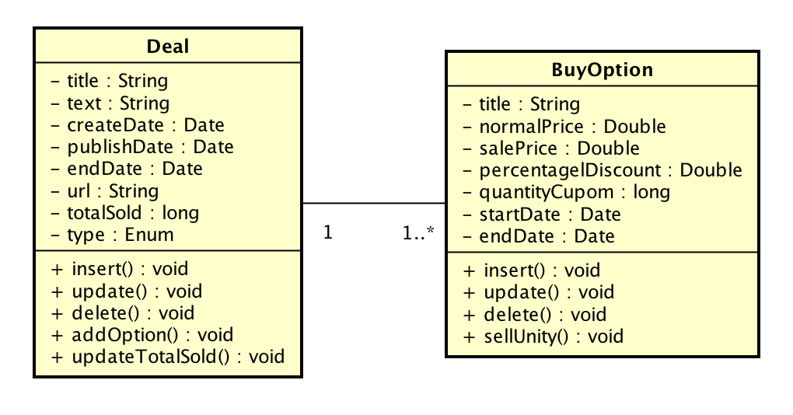

# Desafio Peixe Urbano - Desenvolvedor Java/Scala

Olá!

Primeiramente agradecemos sua disponibilidade para o nosso desafio.
Como parte do processo seletivo do Peixe Urbano, gostaríamos que resolvesse um desafio técnico e conforme seu desempenho daremos continuidade ao processo.

Durante o desenvolvimento de preferência para implementação em Java. O objetivo é avaliar como será o desenvolvimento do código-fonte em termos de:

- Clareza e qualidade de código
- Arquitetura e organização do projeto
- Cobertura de testes
- Conhecimento na linguagem Java

Observação:
- Seria interessante a solução ser executada em algum container web
- Sinta-se à vontade para utilizar qualquer tipo de framework
- Utilize um mecanismo de persistência aderente a solução
- **Bônus:** Deploy da aplicação em ambiente AWS

Crie um projeto em seu Github para vermos os passos feitos através dos commits para resolver o desafio, descreva as instruções de uso através do READE.md, caso acredite ser necessário.

Qualquer dúvida maior pode nos perguntar, mas no geral, divirta-se!

## Peixe Urbano

O Peixe Urbano é a maior plataforma de ofertas locais do Brasil. Com mais de 30 milhões de usuários cadastrados e milhares de ofertas de gastronomia, entretenimento, estética, turismo e produtos, sua missão é conectar pessoas a serviços com o melhor custo-benefício. 

Ao longo dos anos, o Peixe Urbano vem evoluindo seu modelo de negócios, simplificando e melhorando a experiência do usuário. Hoje, a empresa funciona como uma grande plataforma de vantagens, onde o consumidor pode encontrar facilmente o que procura, quando quiser e de onde estiver, por meio do site ou do aplicativo móvel.

Atualmente necessitamos de uma plataforma web de vantagens simplificada do qual conta com a publicação de ofertas e suas respectivas opções de compra, representado pelo seguinte diagrama de classes:

 

| Deal (oferta)  | BuyOption (Opção de compra)  |
|---|---|
| Título da oferta | Título  |
| Texto de destaque | Preço de venda normal  |
| Data de criação | Preço de venda com desconto  |
| Data de publicação | Percentual de desconto |
| Validade da oferta (em dias) | Quantidade de cupons |
| URL da oferta | Data de entrada |
| Total geral de cupons vendidos | Data de saída | 
| Tipo (local, produto, viagem) |  |

Uma oferta possui várias opções de compra, sendo que devemos primeiramente realizar a persistência de uma oferta e após vincular as possíveis opções de compra, observe o exemplo abaixo:

**Oferta:** 
Frigideira Cerâmica Titânio Titanium: Tamanho 20cm, 24cm ou 28cm.
 
**Opção de compra:** 
1. Tamanho 20cm - R$ 89,90
2. Tamanho 24cm - R$ 149,90 por R$ 129,90
3. Tamanho 28cm - R$ 169,90 por R$ 139,90

Realize a modelagem de dados e a implementação do caso de uso proposto, do qual pode ser gradualmente desenvolvido:

1. Modelagem e persistência de dados
2. Interface gráfica para inserir uma oferta
3. Interface gráfica para inserir uma opção de compra
4. Interface gráfica para associar as opções de compra na oferta selecionada
5. Exibição de uma oferta e suas opções de compra
6. Processar a "venda" de uma determinada opção de compra e realizar a atualização dos itens vendidos e seus totais
