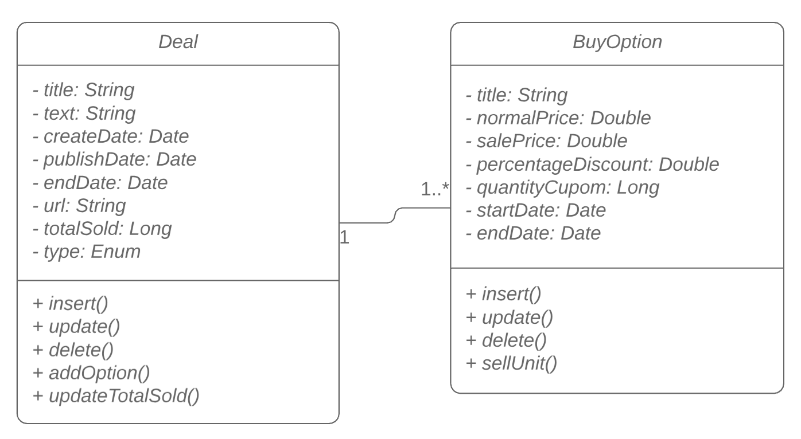
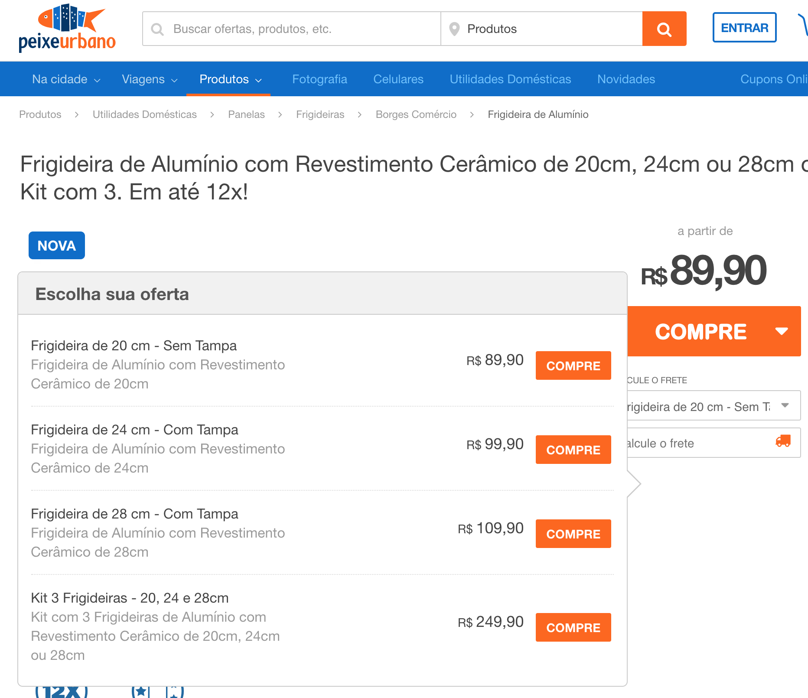

# Desafio Peixe Urbano - Desenvolvedor Java/Scala

Olá!

Primeiramente agradecemos sua disponibilidade para o nosso desafio.
Como parte do processo seletivo do Peixe Urbano, gostaríamos que resolvesse um desafio técnico e conforme seu desempenho daremos continuidade ao processo.

Durante o desenvolvimento de preferência para implementação em Java, mas caso queira implementar utilizando uma linguagem funcional como Scala, sinta-se a vontade.

O **objetivo é avaliar como será o desenvolvimento** do código-fonte em termos de:

1. Clareza e qualidade de código.
2. Arquitetura e organização do projeto.
3. Princípios e boas práticas de design e implementação.
4. Cobertura de testes.
5. Conhecimento em linguagem Java ou Scala.

Observação:

- Foque de forma direta na resolução do problema, entretanto, entregue os requisitos levando em conta boas práticas de programação.
- Seria interessante a solução ser executada em algum container web.
- Sinta-se à vontade para utilizar qualquer tipo de framework.
- Utilize um mecanismo de persistência SQL ou NoSQL.
- **Bônus:** Deploy da aplicação em ambiente AWS.

Crie um projeto em seu Github para vermos os passos feitos através dos commits para resolver o desafio, descreva as instruções de uso através do READE.md, caso acredite ser necessário.

Qualquer dúvida maior pode nos perguntar, mas no geral, divirta-se!

## Peixe Urbano

**Contexto**

O Peixe Urbano é a maior plataforma de ofertas locais do Brasil. Com mais de 30 milhões de usuários cadastrados e milhares de ofertas de gastronomia, entretenimento, estética, turismo e produtos, sua missão é conectar pessoas a serviços com o melhor custo-benefício. 

Ao longo dos anos, o Peixe Urbano vem evoluindo seu modelo de negócios, simplificando e melhorando a experiência do usuário. Hoje, a empresa funciona como uma grande plataforma de vantagens, onde o consumidor pode encontrar facilmente o que procura, quando quiser e de onde estiver, por meio do site ou do aplicativo móvel.

**Necessidade de mercado**

Atualmente precisamos de uma plataforma web de vantagens simplificada do qual conta com a publicação de ofertas e suas respectivas opções de compra, representado pelo seguinte diagrama de classes:

 

| Deal (oferta)  | BuyOption (Opção de compra)  |
|---|---|
| Título da oferta | Título  |
| Texto de destaque | Preço de venda normal  |
| Data de criação | Preço de venda com desconto  |
| Data de publicação | Percentual de desconto |
| Validade da oferta (em dias) | Quantidade total de cupons disponíveis |
| URL da oferta | Data de entrada |
| Total geral de cupons vendidos | Data de saída | 
| Tipo (local, produto, viagem) |  |

Uma oferta possui várias opções de compra, sendo que devemos primeiramente realizar a persistência de uma oferta e após vincular as possíveis opções de compra, observe o exemplo pela imagem e seu descritivo, respectivamente:

Figura 1 - Exemplo de oferta e suas opções de compra no website, disponível para compra.

**Oferta:** 
Frigideira de Alumínio com Revestimento Cerâmico de 20cm, 24cm ou 28cm.
 
**Opção de compra:** 
1. Tamanho 20cm - R$ 89,90
2. Tamanho 24cm - R$ 149,90 por R$ 99,90
3. Tamanho 28cm - R$ 169,90 por R$ 109,90
4. Kit 3 Frigideiras - R$ 249,90 

Realize a modelagem de dados e a implementação do caso de uso proposto, do qual pode ser gradualmente desenvolvido:

1. Arquitetura da aplicação web e todos os mecanismos envolvidos para suportar o desenvolvimento.
2. Modelagem e persistência de dados.
3. Interface gráfica para inserir uma oferta.
4. Interface gráfica para inserir uma opção de compra.
5. Interface gráfica para associar as opções de compra na oferta selecionada.
6. Exibição de uma oferta e suas opções de compra (veja figura 1).
7. Processar a "venda" de uma determinada opção de compra e realizar a atualização dos itens vendidos e seus totais.

**Maiores detalhes de regras de negócios**

#### Oferta

1. Para ser uma oferta válida, ou seja, que esteja publicada no website ela respeita a data de publicação (_publishDate_) que é quando a oferta entra efetivamente no ar e futuramente não é mais exibida quando atinge a data de saída (_endDate_).
2. É realizado um controle global de quantos itens já foram vendidos de determinada oferta pelo campo _"totalSold"_. Esse campo é a soma total da quantidade vendida de todas as opções de compra da oferta.
3. Para cada oferta cadastrada geramos um link (_url_) baseado em seu nome, que representa o slug para acessar a mesma dentro do website, esse slug é único.

#### Opções de compra

1. Assim como a oferta, toda opção de compra tem uma data de publicação (_startDate_) e data de retirada do ar (_endDate_).
2. Quando realizamos o cadastro de uma opção de compra, informamos o valor de mercado praticado (_normalPrice_), o percentual de desconto (caso se aplique, _percentageDiscount_) e consequentemente já armazenando o valor de venda (_salePrice_) para o usuário.
3. Inicialmente cada opção de compra tem uma determinada "quantidade de estoque" (_quantityCupom_), exemplo: OP-1 tem 100 cupons disponíveis, OP-2 tem 30 cupons disponíveis; ao realizar "a venda" através de uma opção de compra, realizamos o decremento da quantidade de cupons da opção selecionada e incrementamos a quantidade global vendida na oferta.
4. Uma opção de compra pode se esgotar e estar indisponível para a compra, mas a oferta pode permanecer no ar com outras opção de compra válidas e com "estoque disponível". Caso todas as opções de compra se esgotem, a oferta é totalmente esgotada e desabilitada para a compra.
5. Quando uma opção de compra se esgota, seu botão de compra é desabilitado.

Mais uma vez, qualquer dúvida maior pode nos perguntar, boa sorte!